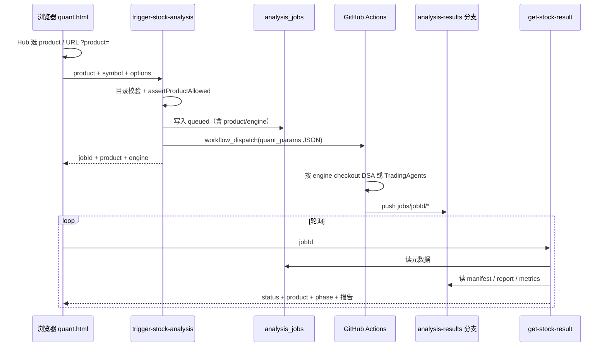

# quant 页面实现说明

> 查阅用文档。描述 `https://nhm.net.cn/quant.html` 当前端到端实现。  
> 部署环境与 CLI 命令见同目录 [AGENTS.md](./AGENTS.md)。  
> 上游升级与 Secrets 迁移见 [quant-upstream-upgrade.md](./quant-upstream-upgrade.md)。

---

## 1. 目标与边界

- **页面**：个人站量化分析页。先选**产品入口**，再进入对应工作区触发分析，展示 Markdown 报告与结构化摘要。
- **产品入口（同页 Hub）**：
  - `quant.html` → 产品卡片 Hub
  - `quant.html?product=dsa` → 标准投研（Daily Stock Analysis）
  - `quant.html?product=tradingagents` → 多智能体辩论（TradingAgents）
  - `quant.html?jobId=` → 恢复任务；从结果 / localStorage 推断 `product`，并保留在 URL
- **算力**：不在浏览器 / uniCloud 内跑模型；由本仓 `mhm_net_cn` 的 GitHub Actions 按 `engine` 拉取对应上游源码后执行。
- **关联键**：`jobId`（一次点击 = 一次任务 = 一份不可变结果）。
- **唯一结果源**：本仓 `analysis-results` 分支上的 `jobs/{jobId}/*`（不按引擎分仓）。
- **展示产物**：
  - `jobs/{jobId}/report.md`
  - `jobs/{jobId}/market_review.md`（DSA 可选）
  - `jobs/{jobId}/manifest.json`（含 `phase` / `product` / `engine` / `runId`）
  - `jobs/{jobId}/metrics.json`（成功时强制；缺文件则发布脚本启发式补全）
- **不做（本阶段）**：登录 / 支付 / 真实会员校验、并排双跑对比、向浏览器暴露 PAT。

---

## 2. 架构总览

编排层策略：`product` 是产品/会员键；`engine` 是实际 runner（现阶段 1:1）。  
结果契约统一为扁平 `jobs/{jobId}/*`，前端轮询 API 不变。

---

## 3. 产品目录（会员挂钩点）

| 位置 | 作用 |
|------|------|
| `js/quant-catalog.js` | 前端产品定义、capabilities、进度档、`resolveEntitlements` |
| `…/trigger-stock-analysis/quant-catalog.js` | 后端同构目录；**必须再校验**，不可只信前端 |

每个产品字段要点：`id`、`engine`、`requiredPlan`、`capabilities`、`quotaKey`、进度档（DSA ~15min，TA ~35min）。

本阶段 `resolveEntitlements` 写死 guest 开放 `dsa` + `tradingagents`。  
以后只改 entitlements / `requiredPlan`；Hub 锁卡 + `assertProductAllowed` → `PRODUCT_NOT_ALLOWED`（403）。

占位产品 `custom-agent`：`enabled: false`，不接引擎。

---

## 4. 前端

| 路径 | 职责 |
|------|------|
| `quant.html` | `#product-hub` 卡片；`#tool-hero` 工作区；按 capabilities 显隐选项 |
| `js/quant-catalog.js` | 产品目录与 entitlements 钩子 |
| `js/quant-config.js` | 云函数 URL、仓库常量、`DEFAULT_PRODUCT_ID` |
| `js/quant-progress.js` | 进度常量；运行时由 catalog profile 覆盖 |
| `js/quant.js` | Hub 切换、`product`/`engine` 入请求、分产品进度与轮询上限 |
| `js/quant.bundle.js` | **构建产物**（`npm run build:quant`）；勿手改 |

URL：触发后写 `jobId` 且**保留** `product`。  
TA 工作区强制单标的、`stocks-only`，隐藏多标的/大盘/筹码/实时等 DSA 选项。

---

## 5. 云函数

### `trigger-stock-analysis`

- 校验 `product` ∈ 目录；`engine` **以目录为准**
- `assertProductAllowed`（本阶段恒 true）
- TA：`MAX_SYMBOLS_PER_JOB=1`，拒绝 `market-only`
- fingerprint 含 `product`；DB / `quant_params` 写入 `product` + `engine`

### `get-stock-result`

- 读路径仍为 `jobs/{jobId}/*`
- 响应透传 `product` / `engine`（DB 或 manifest）

---

## 6. GitHub Actions 双引擎

工作流：`.github/workflows/quant-stock-analysis.yml`

| engine | checkout | Python | 入口 |
|--------|----------|--------|------|
| `dsa`（默认） | `vars.UPSTREAM_REPO` → daily_stock_analysis（默认 ref=`dev`） | 3.11 | `main.py` |
| `tradingagents` | `vars.TA_UPSTREAM_REPO` → TradingAgents（默认 ref=`dev`） | 3.12 | `run_tradingagents.py` → `adapt_ta_to_job.py` |

脚本：

- `scripts/run_quant_analysis.sh` — 按 `QUANT_ENGINE` 分支
- `scripts/run_tradingagents.py` — 无头 `TradingAgentsGraph.propagate`
- `scripts/adapt_ta_to_job.py` — 报告树 → 扁平 `report.md` / `metrics.json`
- `scripts/ticker_normalize.py` — TA 代码归一
- `scripts/quant_bridge.sh` / `push_unicloud_result.py` — 终态仍写统一契约

默认 timeout：`vars.ANALYSIS_TIMEOUT_MINUTES`（建议 60，覆盖 TA）。

---

## 7. 会员以后怎么接（本阶段只留钩子）

1. 登录后云函数用真实 `user.plan` 替换 `resolveEntitlements`
2. 目录改 `requiredPlan` → Hub 自动锁卡
3. 配额按 `quotaKey` 分桶
4. `analysis_jobs.product` 已可做用量统计

---

## 8. 部署备忘

1. 改 `js/quant*.js` 后执行 `npm run build:quant`
2. 上传 `trigger-stock-analysis` / `get-stock-result`（含同目录 `quant-catalog.js`）
3. 配置 TA 相关 Secrets / Variables（见 quant-upstream-upgrade.md）
4. 静态页部署到托管

---

## 9. 验收清单

- [ ] `quant.html` 只见入口卡；点入后 URL 带 `product=`
- [ ] DSA 工作区行为与现网一致
- [ ] TA 仅单标的；`analysis_jobs.product=tradingagents`
- [ ] `?jobId=` 可恢复并回到对应工作区
- [ ] 旧书签缺 product 时从 job 推断
- [ ] 目录关闭 TA 时：卡锁定且 trigger 返回 `PRODUCT_NOT_ALLOWED`
