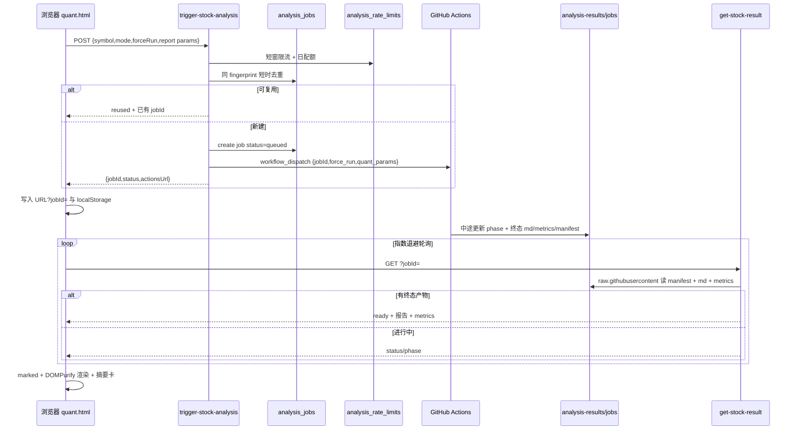

# quant 页面实现说明

> 查阅用文档。描述 `https://nhm.net.cn/quant.html` 当前端到端实现。  
> 部署环境与 CLI 命令见同目录 [AGENTS.md](./AGENTS.md)。

---

## 1. 目标与边界

- **页面**：个人站量化分析页，输入股票代码后触发云端分析，展示 Markdown 报告与结构化摘要。
- **算力**：不在浏览器 / uniCloud 内跑模型，而由 GitHub Actions 仓库 `king08723/daily_stock_analysis` 执行。
- **关联键**：`jobId`（一次点击 = 一次任务 = 一份不可变结果；URL `?jobId=` 可恢复）。
- **唯一结果源**：`analysis-results` 分支上的 `jobs/{jobId}/*`（不经 Actions→uniCloud POST）。
- **展示产物**：
  - `jobs/{jobId}/report.md`
  - `jobs/{jobId}/market_review.md`
  - `jobs/{jobId}/manifest.json`（含 `phase` / `phaseMessage` / `runId`）
  - `jobs/{jobId}/metrics.json`（可选；缺省时前端仍只渲染 Markdown）
  - 可选索引：`docs/{SYMBOL}/latest.json`、`docs/{SYMBOL}/history.json`
- **不做**：不以 bridge / since / Artifact / Actions 回调写库作为结果路径。

---

## 2. 架构总览



### 一句话链路

页面点分析 → uniCloud 限流/去重后创建 `jobId` 并代触发 Actions → Actions 写 `jobs/{jobId}/`（manifest phase + md + metrics）→ 前端按 `jobId` 轮询云函数（只用 raw，防 CDN 假排队）→ 消毒渲染；刷新可用 `?jobId=` 恢复。

---

## 3. 组件与文件

| 层级 | 路径 / 地址 | 作用 |
|------|-------------|------|
| 静态页 | `quant.html` | 输入框、高级选项、进度面板、摘要卡、报告区、免责声明 |
| 前端逻辑 | `js/quant.js` | 触发、URL/localStorage 恢复、phase 进度、退避轮询、消毒渲染 |
| 触发云函数 | `hbuilder/.../cloudfunctions/trigger-stock-analysis/` | 限流、去重、创建 job、代持 PAT、dispatch |
| 结果云函数 | `hbuilder/.../cloudfunctions/get-stock-result/` | GET 按 jobId 读 GitHub raw 文件 |
| 网关 | `https://f.nhm.net.cn/trigger-stock-analysis` | URL 化触发 |
| 网关 | `https://f.nhm.net.cn/get-stock-result` | URL 化结果 |
| DB 集合 | `analysis_jobs` | 触发审计与去重指纹；结果正文以 GitHub 为准 |
| DB 集合 | `analysis_rate_limits` | 按 IP 的短窗 + 日配额（跨实例） |
| 分析仓库 | `king08723/daily_stock_analysis` | Python + LLM 分析 |
| 同步脚本 | `scripts/push_unicloud_result.py` | 只写 `jobs/{jobId}/` |
| 公开结果分支 | `analysis-results` | `jobs/{jobId}/*`；可选 `docs/{SYMBOL}/*.json` |

---

## 4. 前端实现（quant.js）

### 4.1 触发

```http
POST https://f.nhm.net.cn/trigger-stock-analysis
Content-Type: application/json

{
  "symbol": "AAPL,MSFT",
  "mode": "stocks-only",
  "reportType": "simple",
  "reportLanguage": "zh",
  "notificationChannels": ["email"],
  "notificationEmail": "name@example.com",
  "includeMarketContext": true,
  "multiSymbols": true,
  "enableRealtimeQuote": true,
  "enableRealtimeTechnicalIndicators": true,
  "enableChipDistribution": true,
  "forceRun": false
}
```

成功响应含 `jobId`；前端写入 `quant.html?jobId=` 与 `localStorage`，只按它轮询。  
若 `reused: true`，表示命中同参数短时去重，前端继续轮询已有任务。

默认值：

- `mode=stocks-only`
- `reportType=simple`
- `reportLanguage=zh`
- `includeMarketContext=true`（高级选项可关）
- `multiSymbols=true`
- `enableRealtimeQuote=true`（高级选项可关）
- `enableRealtimeTechnicalIndicators=true`（高级选项可关）
- `enableChipDistribution=true`（高级选项可关）
- 通知渠道只允许新增邮件；`notificationEmail` 为空时不新增通知目标
- `forceRun=false`；勾选「重新跑一次」可跳过去重

### 4.2 轮询

```http
GET https://f.nhm.net.cn/get-stock-result?jobId={jobId}
```

- 前 2 分钟约 3s，之后退避至 15s，上限约 15 分钟
- `succeeded`+`ready` 渲染；`failed`/`timeout`/`EMPTY_REPORT` 失败；`queued`/`running` 继续等
- 若响应含 `phase`，进度条按 phase 驱动；否则退回虚拟时间线
- 失败/超时时展示 `actionsUrl`、`manifestUrl` 链接

### 4.3 任务恢复

- URL：`quant.html?jobId=xxx` 为恢复入口（刷新自动续查）
- localStorage：`quant_recent_jobs_v1` 最近最多 8 条
- 无 URL 时显示「继续查看上次任务」

---

## 5. 云函数：trigger-stock-analysis

1. CORS / 校验 symbol / 邮件  
2. **持久化限流**（集合 `analysis_rate_limits`）：同 IP 5 次 / 5 分钟；日配额 20 次；失败请求也计入  
3. **同参数去重**：`requestFingerprint = sha256(symbol|mode|reportType|…)`；8 分钟内 `queued`/`running` 直接复用；10 分钟内 `succeeded` 复用（除非 `forceRun=true`）  
4. 生成 `jobId`，写入 `analysis_jobs`（`queued`，不存报告正文）  
5. `workflow_dispatch` inputs：`stock_symbol`、`job_id`、`mode`、`force_run`、`quant_params`  
6. 返回 `{ jobId, status, phase, actionsUrl, reused?, params }`；派发失败则标 `failed` + `errorCode=GITHUB_API_ERROR`

环境变量：`GITHUB_PAT`

---

## 6. GitHub Actions：参数解析与发布结果

### 6.1 quant_params 解析（「执行股票分析」步骤）

`workflow_dispatch` 已含 `job_id`、`mode`、`quant_params`、`force_run`。扩展参数在分析步骤 env 注入后解析。

### 6.2 发布结果与 phase 约定

同步脚本只写 GitHub，**不再 POST uniCloud**。

产物：

```text
jobs/{jobId}/report.md
jobs/{jobId}/market_review.md
jobs/{jobId}/manifest.json
jobs/{jobId}/metrics.json          # 可选
docs/{SYMBOL}/latest.json         # 可选索引
docs/{SYMBOL}/history.json        # 可选历史（最近 N 次）
```

#### manifest.json 推荐字段

```json
{
  "jobId": "job_xxx",
  "symbol": "00700.HK",
  "status": "running",
  "phase": "analyze",
  "phaseMessage": "正在运行 LLM 推理…",
  "updatedAt": 1710000000000,
  "generatedAt": 0,
  "finishedAt": 0,
  "runId": "1234567890",
  "error": "",
  "errorCode": ""
}
```

`phase` 枚举：`queued | checkout | setup | fetch | analyze | publish | succeeded | failed`。  
终态时 `status` 为 `succeeded` / `failed` / `timeout`，并写齐 `report.md`（及可选 `market_review.md`、`metrics.json`）。

#### metrics.json 推荐字段

```json
{
  "rating": "买入/中性/卖出",
  "confidence": 0.72,
  "trend": "上行",
  "supportLevels": [300, 290],
  "resistanceLevels": [330],
  "riskLevel": "中",
  "dataAsOf": 1710000000000,
  "modelVersion": "v1",
  "realtimeEnabled": true,
  "degradedFeatures": []
}
```

> 分析仓库侧若尚未写出 `phase` / `metrics.json` / `history.json`，本站前端与云函数会降级：无 phase 用虚拟进度，无 metrics 只显示 Markdown，无 history 隐藏历史面板。

---

## 7. 云函数：get-stock-result

- **只支持 GET**（POST 返回 405；无 `jobId` 时返回 `MISSING_JOB_ID`）
- 查询顺序：本地 `failed`（触发失败）→ DB 成功结果缓存 → GitHub `jobs/{jobId}/` → 否则 `queued`
- **读取策略**：`raw.githubusercontent.com` → GitHub Contents API（`Accept: application/vnd.github.raw`）→ jsDelivr；建议云函数配置 `GITHUB_PAT`
- manifest 声明 `reportLength`/`reportSha` 但正文读失败 → `errorCode=FETCH_FAILED`、`status=running`（前端继续轮询），**不**误判 `EMPTY_REPORT`
- `succeeded` 且 manifest 也未声明有正文 → `errorCode=EMPTY_REPORT`
- 仅一份报告 → 按 manifest 期望判断；stocks-only 无复盘不算 `PARTIAL_RESULT`
- 读到成功终态且正文非空后，回写 DB 成功结果缓存（`report` / `marketReview` / `metrics` / sha / 时间）；GitHub 仍是权威源，DB 仅用于同 `jobId` 二次打开加速
- 读取 GitHub 时按 manifest 跳过未声明的可选文件（如无复盘声明则不读 `market_review.md`），减少可选文件缺失导致的等待
- 响应扩展字段：`phase`、`phaseMessage`、`updatedAt`、`runId`、`actionsUrl`、`errorCode`、`metrics`、`resultFiles`
- `source`：`github-job` | `db-cache` | `db` | `pending`

---

## 8. 设计取舍

| 问题 | 方案 |
|------|------|
| 请求与结果对齐 | 唯一键 `jobId`；URL/localStorage 恢复 |
| 海外 Runner 连不上国内网关 | 废弃 Actions→uniCloud 回写 |
| 结果如何送达前端 | 云函数按 jobId 读 GitHub 文件；成功后写 DB 缓存，后续同 jobId 优先读缓存 |
| CDN 导致假排队 | 新文件优先 Contents API；CDN 仅作第三兜底 |
| raw 超时误判 EMPTY_REPORT | manifest 有 reportLength/sha 时改为 FETCH_FAILED 并继续轮询 |
| 公网刷 Actions | DB 限流 + 日配额 + fingerprint 去重 |
| 进度体验 | phase 驱动；无 phase 时虚拟进度兜底 |
| 库膨胀 | 只缓存成功结果正文；若后续报告明显变大，再迁移到 uniCloud 云存储 |

---

## 9. 部署速查

见 [AGENTS.md](./AGENTS.md)。上传两个云函数后，需在 uniCloud 控制台确认集合：

- `analysis_jobs`（已有；建议为 `requestFingerprint` + `requestedAt`、`clientIp` 建查询索引）
- `analysis_rate_limits`（新建；字段：`clientIp`、`shortWindowStart`、`shortCount`、`dayWindowStart`、`dayCount`）

```bash
/Applications/HBuilderX.app/Contents/MacOS/cli cloud functions --upload cloudfunction --prj hbuilder --provider alipay --name get-stock-result --force
/Applications/HBuilderX.app/Contents/MacOS/cli cloud functions --upload cloudfunction --prj hbuilder --provider alipay --name trigger-stock-analysis --force
```

静态页：`npm run deploy`（或 `watch`）。

### 回滚 / 降级

- 限流异常：可临时改云函数跳过 `checkPersistentRateLimit`（保留内存或直接放行）。
- 去重误伤：前端勾选「重新跑一次」(`forceRun=true`)。
- phase/metrics 未就绪：前端自动降级，无需回滚。
- 读取策略回退：仅在确认 raw 不可达时再启用 CDN 兜底（`allowCdn`）。

---

## 10. 排查

| 现象 | 原因 | 处理 |
|------|------|------|
| Actions 成功但页面 EMPTY_REPORT | 旧版云函数只读 raw 超时 | 上传新版 get-stock-result；建议配置 GITHUB_PAT |
| Actions 成功但页面转圈 | manifest 未写出 / jobId 不一致 | 查 `jobs/{jobId}/manifest.json`（raw 或 API） |
| FETCH_FAILED 持续 | 云函数出网受限 / 无 PAT 额度 | 给 get-stock-result 配 GITHUB_PAT；查函数日志 |
| 触发失败 | PAT / workflow input | 查 trigger 日志；看 `errorCode` |
| 429 / 日配额 | 限流命中 | 等窗口结束或次日；查 `analysis_rate_limits` |
| 复用旧任务 | fingerprint 去重 | 勾选「重新跑一次」 |
| DB 仍是 queued | 正常：结果在 GitHub；轮询后可回写元数据 | 以接口 `source=github-job` 为准 |
| EMPTY_REPORT | succeeded 但 MD 空 | 查 Actions 发布步骤与文件路径 |
| 直接打开 get-stock-result 报 MISSING_JOB_ID | 未带查询参数 | 正常；需 `?jobId=` |

---

## 11. 相关链接

- 线上：https://nhm.net.cn/quant.html
- 分析仓库：https://github.com/king08723/daily_stock_analysis
- 任务示例：`.../analysis-results/jobs/{jobId}/manifest.json`
